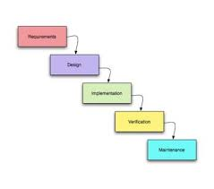
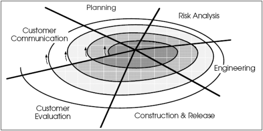

# MDPLP
# Tugas 1
Carilah minimal 3 MPPL yang mewakili klasik maupun agile. Jelaskan secara singkat dan tuliskan pada repo tersebut.
<h2>
1. Model Air Terjun (Waterfall) </h2>

Model waterfall dapat kita analogikan sebagai sebuah air terjun, Yang pastinya mengalir dari atas dan jatuh kebawah. Dan dapat disimpulkan model waterfall adalah model pengembangan software yang bertahap, mulai dari awal hingga akhir. sehingga kita perlu melalui tahapan - tahapannya secara runtut dan tidak dapat dikerjakan bersamaan. berikut adalah urutanya :

* Requirement Analysis
* System Design
* Implementation
* Testing
* Deployment
* Maintenace

<h2>
2. Model Spiral</h2>

Model yang pengerjaanya berulang tiap tahapnya. Model ini proses pengembangan perangkat lunak berbasis resiko. Proses pengembangan dalam model Spiral , dimulai dengan sejumlah kecil persyaratan dan melewati setiap tahap pengembangan untuk rangkaian persyaratan tersebut. fase model spiral :

* plannig
* Risk Analysis
* Eginering
* Evaluation
<h2>
3. Model DevOps </h2>

model devops adalah model yang menekankan pada budaya organisasi. Yang artinya selain memperhatikan dalam tahapan pengembangan perangkat lunak juga mengedepankan kerjasama antar tim.
<h2>
4. Model Agile </h2>

Model agile adalah pendekatan khusus untuk management proyek yang digunakan untuk pengembangan perangkat lunak. Model ini sering digunakan oelh perusahaan maupun startup. karena dirasa paling cocok diterapkan dalam penegem bangan perangkat lunak dalam jangka waktu pendek maupun pada jangka waktu panjang.